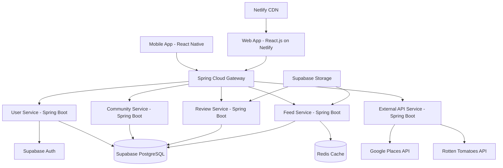

# Design Document

## Overview

The social recommendation app is designed as a cross-platform solution that combines traditional review functionality with social networking features. The platform will be accessible through both mobile apps (React Native) and web browsers (React.js), sharing the same backend services. The architecture emphasizes community-based trust, external API integration for data enrichment, and scalable social features. The system will be built using a microservices architecture to handle different domains (users, communities, reviews, external integrations) independently.

## Architecture

### High-Level Architecture



### Technology Stack

- **Mobile App**: React Native for cross-platform development
- **Web App**: React.js with responsive design, hosted on Netlify
- **Backend**: Java with Spring Boot microservices (deployed on cloud provider)
- **Database**: Supabase PostgreSQL with built-in real-time features
- **Authentication**: Supabase Auth with social login support
- **Image Storage**: Supabase Storage
- **Caching**: Redis (deployed on cloud provider like AWS ElastiCache, Google Cloud Memorystore, or self-hosted)
- **API Gateway**: Spring Cloud Gateway
- **Web Hosting**: Netlify with automatic deployments from Git

## Components and Interfaces

### User Service

**Responsibilities:**
- User registration, authentication, and profile management
- User relationships and blocking functionality
- Privacy settings management

**Key Interfaces:**
```java
@Entity
public class User {
    @Id
    private UUID id;
    private String email;
    private String username;
    private String displayName;
    private String profilePicture;
    private LocalDateTime createdAt;
    
    @Embedded
    private PrivacySettings privacySettings;
}

@Embeddable
public class PrivacySettings {
    @Enumerated(EnumType.STRING)
    private ProfileVisibility profileVisibility;
    private boolean allowDirectMessages;
    private boolean showInSearch;
}
```

### Community Service

**Responsibilities:**
- Community creation and management
- Membership management and moderation
- Community privacy and access control

**Key Interfaces:**
```java
@Entity
public class Community {
    @Id
    private UUID id;
    private String name;
    private String description;
    
    @Enumerated(EnumType.STRING)
    private CommunityType type;
    private int memberCount;
    private LocalDateTime createdAt;
    
    @OneToMany(mappedBy = "community")
    private List<CommunityMembership> memberships;
}

@Entity
public class CommunityMembership {
    @Id
    private UUID id;
    
    @ManyToOne
    private User user;
    
    @ManyToOne
    private Community community;
    
    @Enumerated(EnumType.STRING)
    private MemberRole role;
    private LocalDateTime joinedAt;
    
    @Enumerated(EnumType.STRING)
    private MembershipStatus status;
}
```

### Review Service

**Responsibilities:**
- Review creation and management
- Integration with external APIs for item data
- Photo upload and management
- Review aggregation and scoring

**Key Interfaces:**
```java
@Entity
public class Review {
    @Id
    private UUID id;
    
    @ManyToOne
    private User user;
    
    @ManyToOne
    private ReviewableItem item;
    
    @Enumerated(EnumType.STRING)
    private ItemType itemType;
    private int rating; // 1-5
    private String title;
    private String description;
    
    @ElementCollection
    private List<String> photos;
    
    @ManyToMany
    private Set<Community> communities;
    
    private LocalDateTime createdAt;
    private LocalDateTime updatedAt;
}

@Entity
public class ReviewableItem {
    @Id
    private UUID id;
    
    @Enumerated(EnumType.STRING)
    private ItemType type;
    private String name;
    
    @Column(columnDefinition = "jsonb")
    private String externalData;
    
    private double aggregatedRating;
    private int reviewCount;
}
```

### Feed Service

**Responsibilities:**
- Personalized feed generation based on community membership
- Content ranking and prioritization
- Post creation and management
- Social interactions (likes, comments)

**Key Interfaces:**
```java
@Entity
public class Post {
    @Id
    private UUID id;
    
    @ManyToOne
    private User user;
    
    private String content;
    
    @ElementCollection
    private List<String> photos;
    
    @ManyToMany
    private Set<Community> communities;
    
    @ManyToOne
    private ReviewableItem referencedItem;
    
    private int likes;
    private LocalDateTime createdAt;
    
    @OneToMany(mappedBy = "post")
    private List<Comment> comments;
}

public class FeedItem {
    private FeedItemType type;
    private Object content; // Review or Post
    private int priority;
    private List<UUID> communityContext;
    private AuthorRelation authorRelation;
}
```

### External API Service

**Responsibilities:**
- Google Places API integration for restaurants and services
- Rotten Tomatoes API integration for movies and TV shows
- Data caching and rate limiting
- Fallback handling for API failures

### Frontend Architecture

**Shared Components and Logic:**
- **State Management**: Redux Toolkit for both mobile and web apps
- **API Client**: Shared API service layer using Axios with Supabase integration
- **Authentication**: Supabase Auth SDK for seamless login across platforms
- **UI Components**: Shared component library with platform-specific styling
- **Business Logic**: Shared hooks and utilities for data fetching and processing

**Platform-Specific Considerations:**
- **Mobile (React Native)**: Native navigation, camera integration, push notifications, app store compliance
- **Web (React.js on Netlify)**: Browser-specific features, SEO optimization, keyboard navigation, automatic HTTPS, CDN distribution
- **Responsive Design**: Adaptive layouts that work across desktop, tablet, and mobile web
- **Netlify Features**: Form handling, serverless functions for API proxying, branch previews, automatic deployments

**App Store Requirements:**
- **iOS App Store**: Apple Developer Program membership ($99/year), compliance with App Store Review Guidelines, privacy policy, TestFlight beta testing
- **Google Play Store**: Google Play Console developer account ($25 one-time fee), compliance with Play Store policies, staged rollout capabilities
- **Cross-Platform**: Consistent user experience, proper app metadata, crash reporting, analytics integration

**Key Interfaces:**
```java
public class GooglePlacesData {
    private String placeId;
    private String name;
    private String address;
    private double rating;
    private int priceLevel;
    private List<String> photos;
    private String phoneNumber;
    private String website;
}

public class RottenTomatoesData {
    private String id;
    private String title;
    private int year;
    private int criticsScore;
    private int audienceScore;
    private List<String> genre;
    private String synopsis;
    private String poster;
}
```

## Data Models

### Database Schema Design

**Users Table:**
- Primary key: user_id (UUID)
- Indexes: email (unique), username (unique)
- Relationships: One-to-many with reviews, posts, community memberships

**Communities Table:**
- Primary key: community_id (UUID)
- Indexes: name, type
- Relationships: Many-to-many with users through community_memberships

**Reviews Table:**
- Primary key: review_id (UUID)
- Foreign keys: user_id, item_id
- Indexes: user_id, item_id, created_at
- JSON fields: photos array, communities array

**Reviewable Items Table:**
- Primary key: item_id (UUID)
- Indexes: type, name
- JSON field: external_data for API responses

**Posts Table:**
- Primary key: post_id (UUID)
- Foreign keys: user_id, referenced_item_id (optional)
- JSON fields: photos array, communities array

### Caching Strategy

**Redis Deployment Options:**
- **Cloud Managed**: AWS ElastiCache, Google Cloud Memorystore, or Azure Cache for Redis
- **Self-Hosted**: Docker containers on same infrastructure as Spring Boot services
- **Development**: Local Redis instance or Docker Compose setup

**Cache Usage:**
- **User Sessions**: Redis with 24-hour TTL
- **Community Data**: Redis with 1-hour TTL, invalidated on updates
- **External API Responses**: Redis with 24-hour TTL for stable data
- **Feed Data**: Redis with 15-minute TTL for personalized feeds

## Error Handling

### API Integration Failures

- **Google Places API**: Graceful degradation to manual entry, cached fallback data
- **Rotten Tomatoes API**: Display warning about missing external data, allow manual entry
- **Rate Limiting**: Implement exponential backoff, queue requests during high traffic

### User Experience Errors

- **Network Connectivity**: Offline mode with local caching, sync when reconnected
- **Image Upload Failures**: Retry mechanism with progress indication
- **Community Access Denied**: Clear error messages with suggested actions

### Data Consistency

- **Review Aggregation**: Use database transactions for atomic updates
- **Community Membership**: Event-driven updates to maintain consistency
- **Feed Generation**: Handle partial failures gracefully, show available content

## Testing Strategy

### Unit Testing

- **Service Layer**: Mock external dependencies, test business logic
- **API Integration**: Mock external APIs, test error scenarios
- **Data Models**: Test validation, relationships, and constraints

### Integration Testing

- **API Endpoints**: Test complete request/response cycles
- **Database Operations**: Test complex queries and transactions
- **External API Integration**: Test with sandbox/staging APIs

### Frontend Testing

**Mobile App Testing:**
- **Component Testing**: React Native component isolation testing
- **Navigation Testing**: Screen transitions and deep linking
- **Offline Functionality**: Network simulation and data persistence

**Web App Testing:**
- **Component Testing**: React.js component testing with Jest and React Testing Library
- **Cross-browser Testing**: Chrome, Firefox, Safari, Edge compatibility
- **Responsive Design Testing**: Various screen sizes and device orientations
- **Accessibility Testing**: WCAG 2.1 compliance, screen reader compatibility

### Performance Testing

- **Feed Generation**: Load testing with large community sizes
- **Image Upload**: Test with various file sizes and network conditions
- **Database Queries**: Performance testing with large datasets

### Security Testing

- **Authentication**: JWT token validation and refresh mechanisms
- **Authorization**: Community access control and privacy settings
- **Input Validation**: SQL injection and XSS prevention
- **Image Upload**: File type validation and malware scanning

### User Acceptance Testing

- **Community Workflows**: End-to-end testing of community joining and interaction
- **Review Creation**: Complete review workflow with external API integration
- **Social Features**: Testing of posts, likes, comments, and feed generation
- **Privacy Controls**: Verification of privacy settings and content visibility